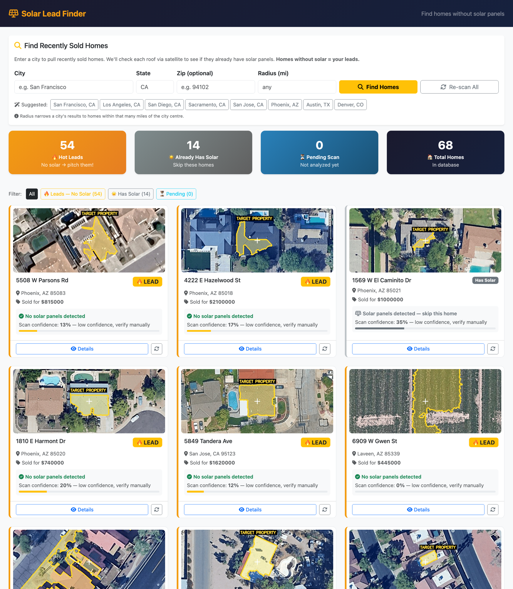
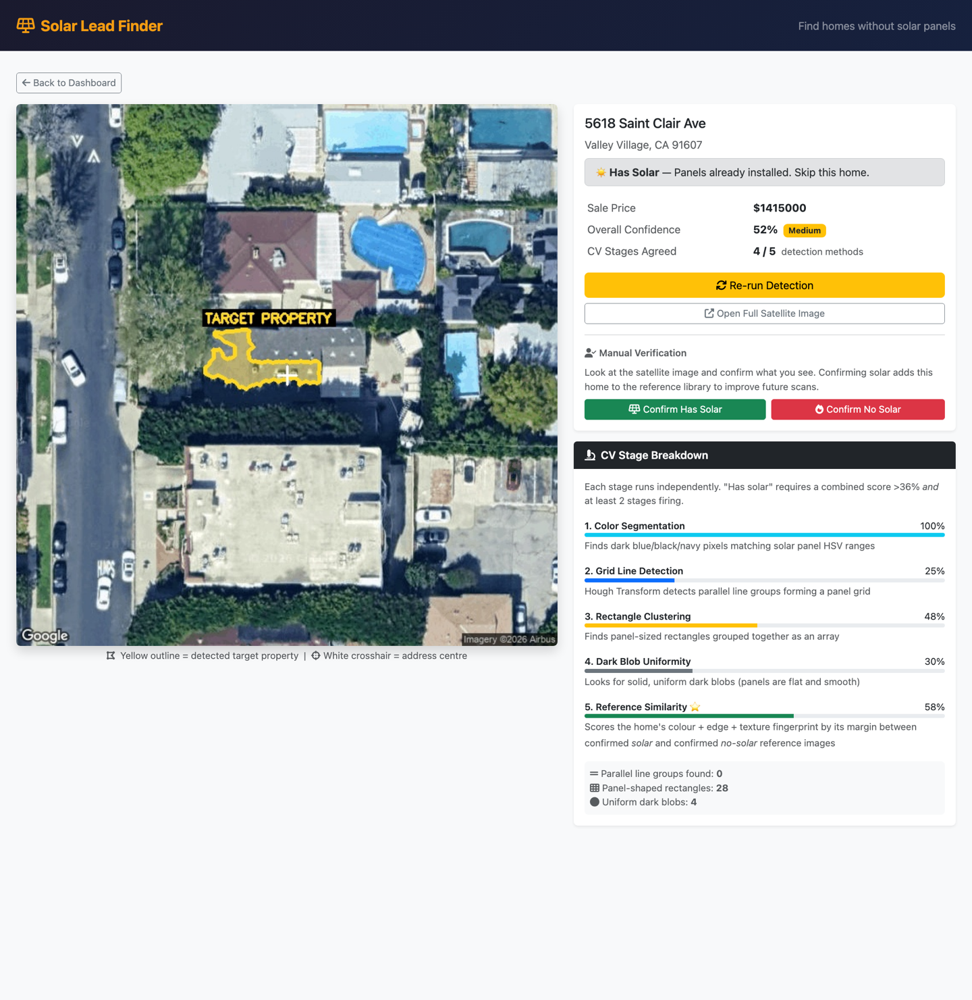

# ☀️ Solar Lead Finder

> **Find the homes that *don't* have solar panels — instant, qualified leads for solar installers.**

[](https://www.python.org/)
[](https://www.djangoproject.com/)
[](LICENSE)

Solar Lead Finder pulls **recently-sold homes** in any city, fetches a **satellite image** of each rooftop, and runs a **computer-vision pipeline** to decide whether solar panels are already installed. Homes **without** panels are flagged as hot leads — because new homeowners without solar are a solar installer's best prospects.

## 🎯 Why it exists
Door-to-door and cold-call solar sales waste enormous time on homes that *already* have panels. This app automates the filtering: enter a city, get back a ranked, map-verified list of un-solared, recently-sold homes.

## 📸 Screenshots
| Leads dashboard | Per-home detection breakdown |
| --- | --- |
|  |  |

The per-home view shows the **transparent 5-stage detection breakdown** — every scan reveals exactly *why* a rooftop was or wasn't flagged, with a live score bar for each computer-vision stage.

## 🌐 Live demo
[](https://render.com/deploy?repo=https://github.com/dgdagreat/solar-lead-finder)

One-click deploy on Render's free tier — config lives in [`render.yaml`](render.yaml). It runs on **mock data** out of the box (no API keys); add a `GOOGLE_STREET_VIEW_API_KEY` in the Render dashboard for live satellite imagery + detection.

## ✨ Features
- **Search recently-sold homes** by city / ZIP, with an optional **radius** filter (Realty-in-US via RapidAPI).
- **Runs with zero API keys** — falls back to realistic mock homes so anyone can demo the full flow instantly.
- **Rooftop satellite imagery** at zoom 20 (Google Static Maps), with the target building auto-highlighted.
- **5-stage OpenCV detector** scores each roof for solar, with a fully **transparent per-stage breakdown** in the UI.
- **Automatic lead flagging** + a one-click **"Confirm Has/No Solar"** human-in-the-loop that improves future scans.
- **Dashboard** with status filters, per-search scoping, and live lead stats.

## 🧠 How the detection works
The detector ([`detector/solar_detector.py`](detector/solar_detector.py)) fuses **five independent signals**, each keyed to a physical property of panel arrays:

| Stage | Signal | Idea |
| --- | --- | --- |
| 1 | **Color segmentation** | clustered dark-navy/blue pixels (scattered noise is penalized) |
| 2 | **Grid-line detection** | evenly-spaced parallel lines (Hough transform + periodicity check) |
| 3 | **Rectangle clustering** | many near-identical-size rectangles grouped together |
| 4 | **Dark-blob uniformity** | flat, smooth, solid blobs of panel size |
| 5 | **Reference similarity** | margin vs. a library of confirmed solar *and* no-solar fingerprints |

A home is marked **has-solar** only when the weighted score clears a threshold **and ≥ 2 stages agree** — which keeps false positives (missed leads) low.

### On accuracy, and the CNN 🛣️
The heuristic pipeline is strong on typical blue panels but can miss **dark / low-contrast arrays** that are pixel-wise hard to tell apart from dark roofs. I prototyped a **MobileNetV3 CNN classifier** ([`detector/cnn.py`](detector/cnn.py)) to replace the heuristics. The honest result: with the limited labeled data on hand — and 8 GB of local RAM ruling out the heavyweight same-domain models — the CNN over-fit and wasn't yet better than the CV pipeline. So the app **ships with the heuristic detector** plus a built-in **"confirm" flywheel** that quietly collects labeled, in-domain training images every time a home is verified. It can be trained later with two commands once enough data is gathered. *(Engineering judgment > shipping a worse model.)*

## 🛠️ Tech stack
- **Backend:** Django 6 · Django REST Framework · SQLite
- **Vision:** OpenCV · NumPy · Pillow · *(optional)* PyTorch / torchvision
- **Data / APIs:** Google Maps Static API · Realty-in-US (RapidAPI) · ATTOM (fallback)
- **Frontend:** Django templates · Bootstrap 5
- **Async *(optional)*:** Celery · Redis

## 🗂️ Project layout
```
solarleads/   Django project (settings, urls, celery)
homes/        Home model · search views · services (property-data APIs) · dashboard
detector/     CV pipeline — solar_detector, reference_comparator, rooftop_annotator,
              image_fetcher, tasks (orchestration) · experimental cnn + trainer
templates/    dashboard + home detail (with the live 5-stage breakdown)
```

## 🚀 Getting started
```bash
git clone https://github.com/dgdagreat/solar-lead-finder.git
cd solar-lead-finder

python3 -m venv venv && source venv/bin/activate
pip install -r requirements.txt

cp .env.example .env          # optional — leave the keys blank to use mock data
python manage.py migrate
python manage.py runserver
```
Open **http://localhost:8000**, enter a city (try **San Francisco, CA**), and watch it pull homes and score each rooftop.

> 💡 **No API keys?** The app detects that and serves realistic mock homes, so you can explore the entire dashboard → detection → lead flow with zero setup.

### Optional: the CNN experiments
```bash
pip install -r requirements-ml.txt
python manage.py prepare_cnn_data     # build a training set from confirmed homes
python -m detector.cnn_train          # fine-tune MobileNetV3 (Apple-Silicon MPS aware)
```

## 🧭 Roadmap
- [ ] Train & ship the MobileNetV3 classifier once the confirm-loop has gathered enough labels
- [ ] Live hosted demo
- [ ] Test coverage for the detector + property-API parsers
- [ ] Map view of leads

## 📄 License
MIT — see [LICENSE](LICENSE).

---
Built by [Daejuan Graham](https://github.com/dgdagreat).
